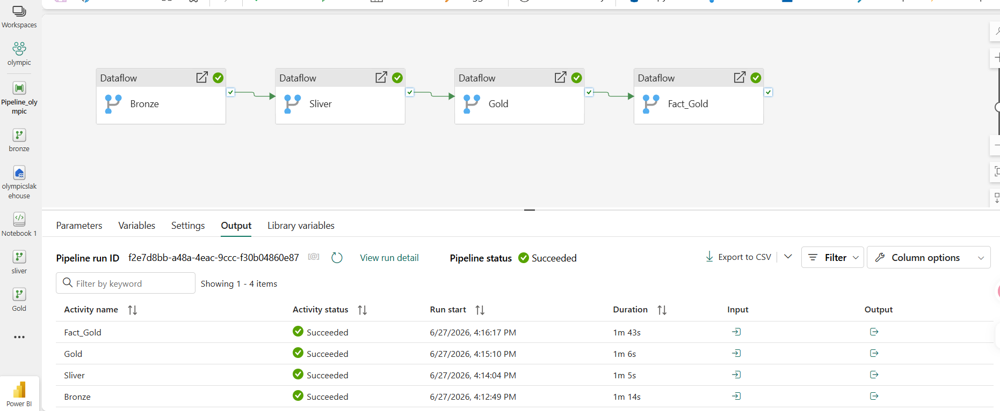
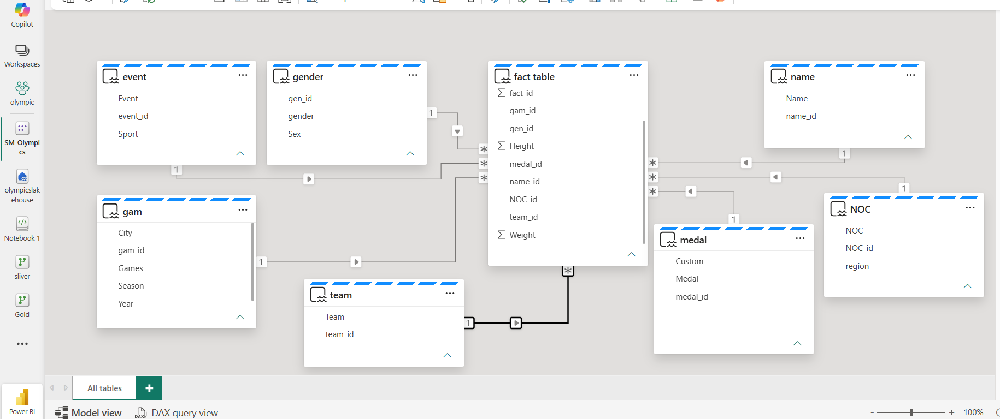
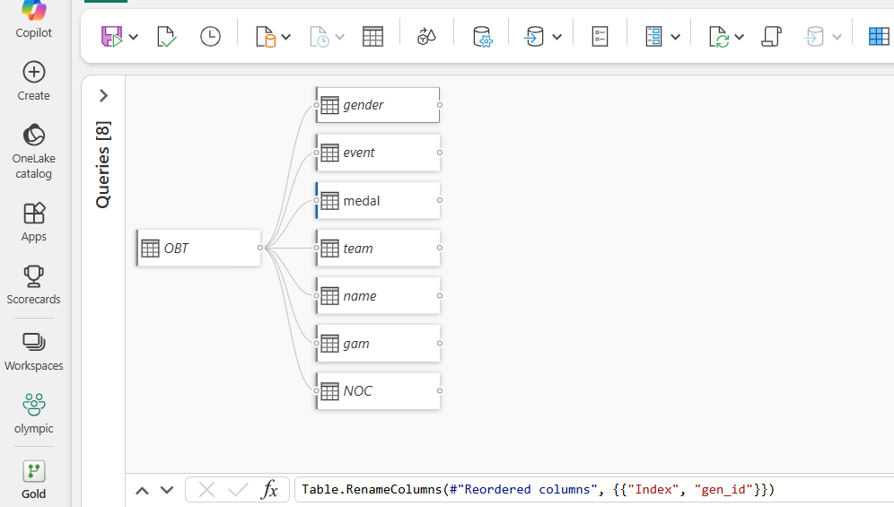
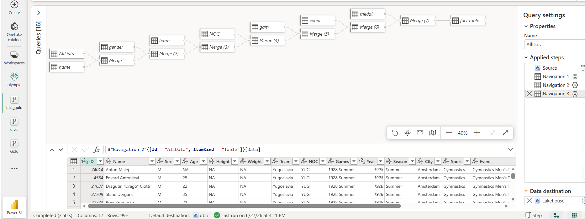

# 🏅 Olympics Data Engineering Project - Microsoft Fabric

## 📌 Project Overview

This project is an end-to-end **Data Engineering solution** built using **Microsoft Fabric**.

The project implements a complete ETL pipeline to ingest, process, transform, and model Olympic Games data using modern data engineering concepts and cloud-native tools.

The workflow starts by reading and exploring the raw Olympic dataset using **Apache Spark (PySpark)** inside Microsoft Fabric Notebook. After preparing the data, the pipeline follows the **Medallion Architecture (Bronze → Silver → Gold)** to organize data processing stages and build an analytics-ready data layer.

The final output is a structured **Semantic Model** containing relationships between Fact and Dimension tables, making the data ready for analysis.

---

## 🛠️ Technologies Used

- Microsoft Fabric
- Fabric Lakehouse
- Fabric Notebook (PySpark / SynapseNotebook)
- Dataflows Gen2 (Power Query)
- Data Pipeline
- Semantic Model
- GitHub

---

## 🏗️ Architecture

---

# 🥉 Bronze Layer

- Raw data ingestion layer.
- Loads Olympic data from source files into the Lakehouse.
- Built using **Dataflows Gen2 (Power Query)** inside Microsoft Fabric.
- Maintains the original structure of the source data with minimal transformations.

---

# 🥈 Silver Layer

- Data cleaning and transformation layer.
- Built using **Power Query (Dataflows Gen2)**.
- Includes:
  - Removing duplicates
  - Handling missing values
  - Data quality improvements
  - Standardizing column formats and data types

---

# 🥇 Gold Layer

- Business-ready analytical layer.
- Built using **Power Query (Dataflows Gen2)**.
- Contains optimized tables for analysis.
- Designed using a dimensional modeling approach:
  - Fact Tables
  - Dimension Tables

---

# 🔄 Data Pipeline Flow

Source Data (CSV / Files)

    ↓

Spark Notebook (PySpark)
Read & Explore Raw Data

    ↓

Bronze Layer
Raw Data Ingestion

    ↓

Silver Layer
Cleaning & Transformation

    ↓

Gold Layer
Fact & Dimension Tables

    ↓

Semantic Model
Relationships & Measures

---

# 📂 Project Components

## 1️⃣ Notebook — `Notebook 1.SynapseNotebook`

- The first step in the ETL process.
- Used **PySpark** to read, inspect, and explore the raw Olympic dataset.
- Prepared the data for the next processing stages inside Microsoft Fabric.

---

## 2️⃣ Dataflows Gen2 (Power Query)

| Dataflow | Layer | Role |
|----------|-------|------|
| `bronze.DataflowFabric` | 🥉 Bronze | Raw data ingestion |
| `sliver.DataflowFabric` | 🥈 Silver | Data cleaning and transformation |
| `fact_gold.DataflowFabric` | 🥇 Gold | Fact table preparation |
| `Gold.DataflowFabric` | 🥇 Gold | Dimension tables output |

---

## 3️⃣ Pipeline — `Pipeline_olympic.Pipeline`

- Orchestrates the complete ETL workflow.
- Controls the execution sequence of the notebook and dataflows.
- Automates the movement of data through Bronze, Silver, and Gold layers.

---

## 4️⃣ Semantic Model

- Final analytical layer built inside Microsoft Fabric.
- Defines relationships between Fact and Dimension tables.
- Contains measures and business logic.
- Provides a structured data model ready for analytics.

---

# 📸 Screenshots

## Gold Layer

## Fact Gold

---

# 🎯 Key Skills Demonstrated

- End-to-End ETL Development
- Medallion Architecture (Bronze → Silver → Gold)
- Data Ingestion using PySpark
- Data Transformation using Power Query (Dataflows Gen2)
- Fabric Lakehouse Development
- Pipeline Orchestration
- Dimensional Data Modeling
- Semantic Model Development
- Cloud Data Engineering using Microsoft Fabric

---

# 👩‍💻 Author

**Shahd Safwat**
